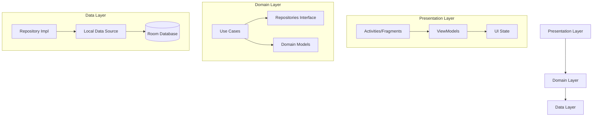
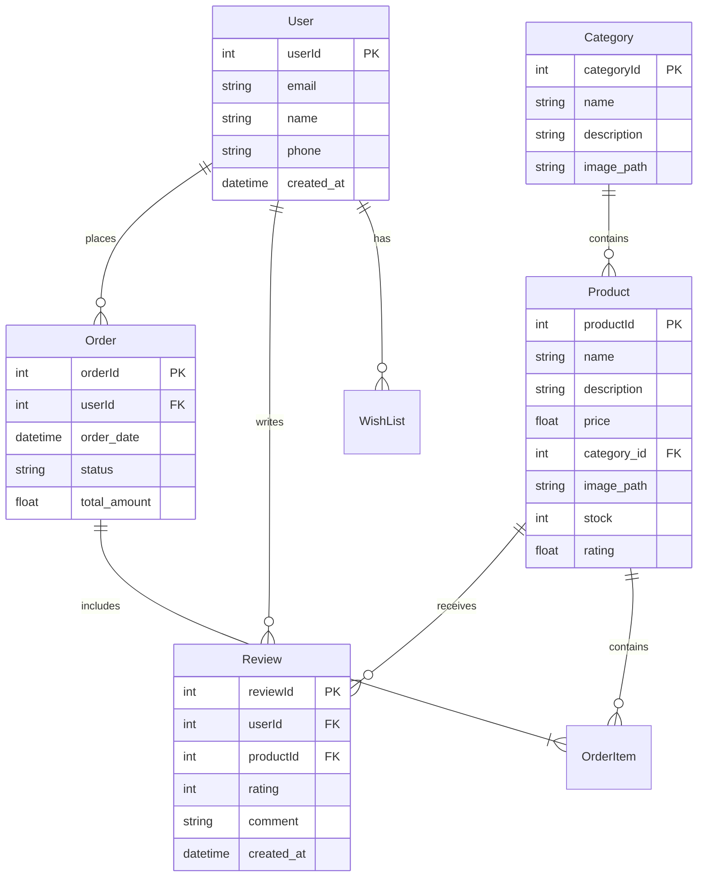

# B-Shop Android App Architecture (Local Version)

## 1. System Architecture

The app follows Clean Architecture principles with three main layers:



## 2. Database Schema (Local Room Database)



## 3. Key Features & Flows

### Local Authentication System
- Simple username/password login
- Local profile management
- Saved user preferences

### Product Management
- Category-based browsing
- Product search with filters
- Detailed product views
- Local product reviews and ratings

### Shopping Experience
- Shopping cart management
- Wishlist functionality
- Order history
- Local order tracking

### Review System
- Product ratings stored locally
- Written reviews
- View all reviews per product

## 4. Technical Stack

### Android Components
- Java as primary language
- MVVM architecture pattern
- AndroidX libraries
- Material Design components

### Local Storage
- Room Database for all data persistence
- SharedPreferences for user settings and app state
- Local file storage for product images

### Third-party Libraries
- Glide for image loading
- Navigation component
- LiveData/ViewModel

## 5. Project Structure

```
com.example.b_shop/
├── data/
│   ├── local/
│   │   ├── dao/
│   │   ├── entities/
│   │   └── AppDatabase
│   └── repositories/
├── domain/
│   ├── models/
│   ├── repositories/
│   └── usecases/
├── ui/
│   ├── auth/
│   ├── cart/
│   ├── category/
│   ├── product/
│   ├── profile/
│   └── wishlist/
└── utils/
```

## Implementation Notes

1. All data will be stored locally using Room Database
2. Product images will be stored in app's local storage
3. Authentication will be handled with local user accounts
4. Sample data will be preloaded for categories and products
5. Orders and reviews will persist locally