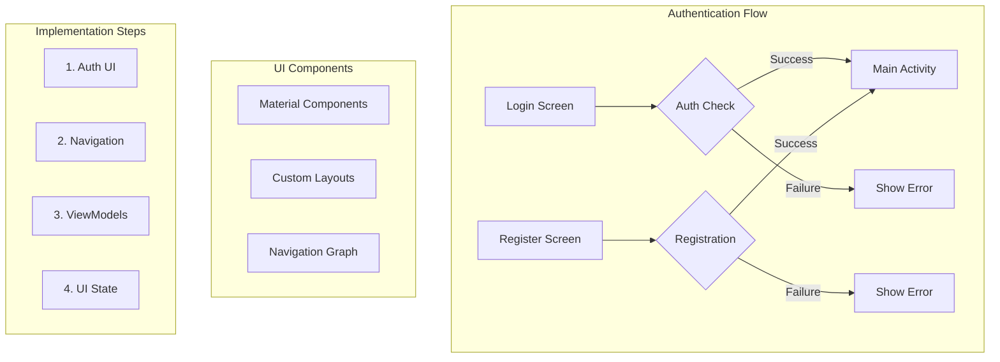

# Authentication and UI Implementation Plan

## 1. Overview

This document outlines the implementation plan for authentication and UI components in the B-Shop Android application.

## 2. Authentication Flow



## 3. Implementation Steps

### 3.1. Authentication UI Components

- Create LoginFragment with Material Design components
  - Email input with validation
  - Password input with visibility toggle
  - Login button with loading state
  - Register navigation link
  - Remember me checkbox
  
- Create RegisterFragment with form validation
  - Email input with validation
  - Name input
  - Phone input with formatting
  - Password input with requirements
  - Confirm password validation
  - Register button with loading state
  
- Common Features
  - Implement password hashing and security checks
  - Add progress indicators for async operations
  - Error handling and display
  - Input validation

### 3.2. Navigation Setup

- Implement Navigation Component
  - Define auth navigation graph
  - Setup navigation actions
  - Handle deep linking
  - Configure back stack behavior
  
- Navigation Features
  - Smooth transitions between screens
  - Handle configuration changes
  - Preserve navigation state
  - Appropriate animations

### 3.3. ViewModels & State Management

- Create AuthViewModel
  - Login state handling
  - Registration state handling
  - Error management
  - Loading state control
  
- UI State Classes
  - LoginState
  - RegistrationState
  - ValidationState
  - ErrorState

### 3.4. Core UI Features

- Base Activity Setup
  - Navigation host setup
  - Toolbar configuration
  - Theme application
  
- Material Design Implementation
  - Custom theme attributes
  - Color scheme
  - Typography
  - Component styles

## 4. Project Structure

```
app/src/main/
├── java/com/example/b_shop/
│   ├── ui/
│   │   ├── auth/
│   │   │   ├── LoginFragment.java
│   │   │   ├── RegisterFragment.java
│   │   │   ├── AuthViewModel.java
│   │   │   └── AuthActivity.java
│   │   └── common/
│   │       ├── BaseActivity.java
│   │       └── BaseFragment.java
│   └── utils/
│       └── ValidationUtils.java
└── res/
    ├── layout/
    │   ├── activity_auth.xml
    │   ├── fragment_login.xml
    │   └── fragment_register.xml
    ├── navigation/
    │   └── nav_graph_auth.xml
    └── values/
        ├── styles.xml
        └── themes.xml
```

## 5. Testing & Security

### 5.1. Input Validation
- Email format validation
- Password strength requirements
- Phone number format validation
- Form completeness checks

### 5.2. Security Measures
- Password hashing (SHA-256)
- Input sanitization
- Session management
- Secure storage of credentials

### 5.3. Testing Strategy
- UI tests for login flow
- UI tests for registration flow
- ViewModel unit tests
- Integration tests for navigation

## 6. Implementation Order

1. Create basic UI layouts
2. Implement navigation
3. Setup ViewModels
4. Add authentication logic
5. Implement error handling
6. Add input validation
7. Apply Material Design styling
8. Write tests
9. Polish UI and animations

## 7. Dependencies

```gradle
// Navigation
implementation 'androidx.navigation:navigation-fragment:2.5.3'
implementation 'androidx.navigation:navigation-ui:2.5.3'

// Material Design
implementation 'com.google.android.material:material:1.8.0'

// ViewModel and LiveData
implementation 'androidx.lifecycle:lifecycle-viewmodel:2.5.1'
implementation 'androidx.lifecycle:lifecycle-livedata:2.5.1'