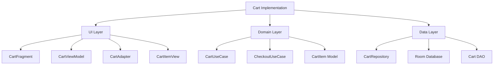

# Cart Page Implementation Specification

## Overview

The Cart page will allow users to view, modify, and checkout items in their shopping cart. This implementation will follow the MVVM architecture pattern and integrate with the existing Room database.



## 1. Data Layer

### CartItem Entity Enhancements
```java
@Entity(tableName = "cart_items",
        foreignKeys = {
            @ForeignKey(entity = User.class,
                       parentColumns = "userId",
                       childColumns = "userId"),
            @ForeignKey(entity = Product.class,
                       parentColumns = "productId",
                       childColumns = "productId")
        })
public class CartItem {
    @PrimaryKey(autoGenerate = true)
    private int cartItemId;
    private int userId;
    private int productId;
    private int quantity;
    private float itemPrice;
    private LocalDateTime addedAt;
    // Getters and setters
}
```

### CartDao Interface
```java
@Dao
public interface CartDao {
    @Query("SELECT * FROM cart_items WHERE userId = :userId")
    LiveData<List<CartItem>> getCartItems(int userId);

    @Query("SELECT SUM(quantity * itemPrice) FROM cart_items WHERE userId = :userId")
    LiveData<Float> getCartTotal(int userId);

    @Insert
    void insertCartItem(CartItem item);

    @Update
    void updateCartItem(CartItem item);

    @Delete
    void deleteCartItem(CartItem item);

    @Query("DELETE FROM cart_items WHERE userId = :userId")
    void clearCart(int userId);
}
```

### CartRepository
```java
public class CartRepository {
    private final CartDao cartDao;
    private final ProductDao productDao;
    private final UserManager userManager;

    // CRUD operations
    public LiveData<List<CartItem>> getCartItems();
    public LiveData<Float> getCartTotal();
    public void addToCart(int productId, int quantity);
    public void updateQuantity(int cartItemId, int quantity);
    public void removeFromCart(int cartItemId);
    public void clearCart();
    
    // Stock validation
    public boolean validateStock(int productId, int quantity);
}
```

## 2. Domain Layer

### CartUseCase
```java
public class CartUseCase {
    private final CartRepository cartRepository;
    private final ProductRepository productRepository;

    public LiveData<List<CartItemWithProduct>> getCartItems();
    public void updateQuantity(int cartItemId, int quantity);
    public void removeItem(int cartItemId);
    public boolean validateCartItems();
}
```

### CheckoutUseCase
```java
public class CheckoutUseCase {
    private final CartRepository cartRepository;
    private final OrderRepository orderRepository;

    public Single<Order> checkout();
    private boolean validateStock();
    private void createOrder();
    private void updateInventory();
    private void clearCart();
}
```

## 3. UI Layer

### CartViewModel
```java
public class CartViewModel extends ViewModel {
    private final CartUseCase cartUseCase;
    private final CheckoutUseCase checkoutUseCase;
    
    private final MutableLiveData<CartUIState> _uiState = new MutableLiveData<>();
    public LiveData<CartUIState> uiState = _uiState;

    // Cart operations
    public void updateQuantity(int cartItemId, int quantity);
    public void removeItem(int cartItemId);
    public void checkout();

    // UI state management
    private void handleError(Throwable error);
    private void updateUIState();
}
```

### CartUIState
```java
public class CartUIState {
    private final List<CartItemUI> items;
    private final float total;
    private final boolean isLoading;
    private final String error;
    private final boolean isCheckoutEnabled;
}
```

### CartFragment
```java
public class CartFragment extends Fragment {
    private CartViewModel viewModel;
    private CartAdapter adapter;
    private FragmentCartBinding binding;

    // UI setup
    private void setupRecyclerView();
    private void setupCheckoutButton();
    private void observeUIState();
    
    // Event handling
    private void handleCheckout();
    private void showError(String message);
}
```

### CartAdapter
```java
public class CartAdapter extends RecyclerView.Adapter<CartViewHolder> {
    private List<CartItemUI> items;
    private final CartItemListener listener;

    interface CartItemListener {
        void onQuantityChanged(int cartItemId, int quantity);
        void onRemoveClicked(int cartItemId);
    }
}
```

## 4. Navigation

Add to nav_graph_main.xml:
```xml
<fragment
    android:id="@+id/cartFragment"
    android:name="com.example.b_shop.ui.cart.CartFragment"
    android:label="Cart">
    
    <action
        android:id="@+id/action_cart_to_checkout"
        app:destination="@id/checkoutFragment" />
</fragment>
```

## 5. Implementation Steps

1. **Data Layer**
   - Implement CartItem entity
   - Create CartDao interface
   - Implement CartRepository

2. **Domain Layer**
   - Implement CartUseCase
   - Implement CheckoutUseCase

3. **UI Layer**
   - Create CartFragment layout
   - Implement CartViewModel
   - Create CartAdapter
   - Implement CartFragment

4. **Integration**
   - Add navigation graph entries
   - Update bottom navigation
   - Add cart icon to product details

## 6. Testing Strategy

1. **Unit Tests**
   - CartRepository tests
   - CartUseCase tests
   - CheckoutUseCase tests
   - CartViewModel tests

2. **Integration Tests**
   - Cart database operations
   - Cart to Order flow

3. **UI Tests**
   - CartFragment display
   - Item quantity updates
   - Checkout process

## 7. Future Enhancements

1. Support for product variants
2. Cart item notes
3. Save for later functionality
4. Cart sharing capabilities
5. Bulk actions (remove multiple items)