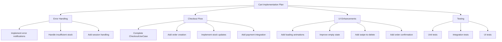

# Cart Implementation Improvements

## Overview

This document outlines the planned improvements for the B-Shop cart implementation, focusing on error handling, checkout flow, UI enhancements, and testing.

## Implementation Plan

## Detailed Tasks

### 1. Error Handling Improvements
- [ ] Implement proper error notifications in CartUseCase
  - Add error callback mechanism
  - Create error message mapping
  - Handle different error scenarios
- [ ] Add stock validation feedback
  - Show available stock information
  - Prevent over-ordering
  - Add visual feedback for stock limits
- [ ] Improve session handling
  - Add proper user feedback for session issues
  - Implement automatic login prompts
  - Handle session expiration gracefully
- [ ] Network error handling
  - Add offline support
  - Implement retry mechanisms
  - Show network status indicators

### 2. Complete Checkout Flow
- [ ] Finish CheckoutUseCase implementation
  - Complete validation logic
  - Add transaction management
  - Implement error recovery
- [ ] Order creation logic
  - Design order data structure
  - Implement order status tracking
  - Add order history
- [ ] Inventory updates
  - Implement stock reservation
  - Add inventory update triggers
  - Handle concurrent updates
- [ ] Payment integration
  - Add payment gateway
  - Implement payment status handling
  - Add payment error recovery
- [ ] Order confirmation
  - Design confirmation flow
  - Add email notifications
  - Implement order tracking

### 3. UI Enhancements
- [ ] Loading animations
  - Add skeleton loading
  - Implement progress indicators
  - Add operation feedback
- [ ] Empty cart improvements
  - Design better empty state
  - Add product suggestions
  - Improve call-to-action
- [ ] Swipe actions
  - Implement swipe-to-delete
  - Add undo functionality
  - Include swipe-to-save
- [ ] Pull-to-refresh
  - Add refresh mechanism
  - Show last update time
  - Implement smooth animations
- [ ] Order confirmation UI
  - Design confirmation screen
  - Add order summary
  - Include next steps
- [ ] Quantity adjustments
  - Add smooth animations
  - Implement gesture controls
  - Show stock limits

### 4. Testing Implementation
- [ ] Unit Tests
  - CartUseCase tests
  - CheckoutUseCase tests
  - Validation logic tests
  - Error handling tests
- [ ] Integration Tests
  - Cart-to-order flow
  - Payment processing
  - Inventory updates
  - User session handling
- [ ] UI Tests
  - Cart interactions
  - Checkout process
  - Error scenarios
  - Edge cases

### 5. Future Enhancements
- [ ] Product variants support
  - Design variant selection
  - Add price differences
  - Handle stock per variant
- [ ] Cart item notes
  - Add note input
  - Handle special instructions
  - Include in order processing
- [ ] Save for later
  - Design saved items list
  - Add move to cart feature
  - Implement persistence
- [ ] Cart sharing
  - Generate share links
  - Handle shared cart access
  - Add collaborative features
- [ ] Bulk actions
  - Select multiple items
  - Batch operations
  - Quantity updates

## Implementation Priority

1. Error Handling (High Priority)
   - Critical for user experience
   - Prevents data inconsistencies
   - Improves reliability

2. Checkout Flow (High Priority)
   - Core business functionality
   - Revenue-critical feature
   - User satisfaction impact

3. UI Enhancements (Medium Priority)
   - Improves user experience
   - Increases engagement
   - Reduces friction

4. Testing (Medium Priority)
   - Ensures reliability
   - Prevents regressions
   - Facilitates maintenance

5. Future Enhancements (Low Priority)
   - Nice-to-have features
   - Can be implemented incrementally
   - Based on user feedback

## Timeline Estimation

- Error Handling: 1 week
- Checkout Flow: 2 weeks
- UI Enhancements: 1 week
- Testing: 1 week
- Future Enhancements: As needed

Total core implementation: ~5 weeks

## Success Metrics

- Reduced cart abandonment rate
- Increased successful checkouts
- Decreased error rates
- Improved user satisfaction
- Better app store ratings