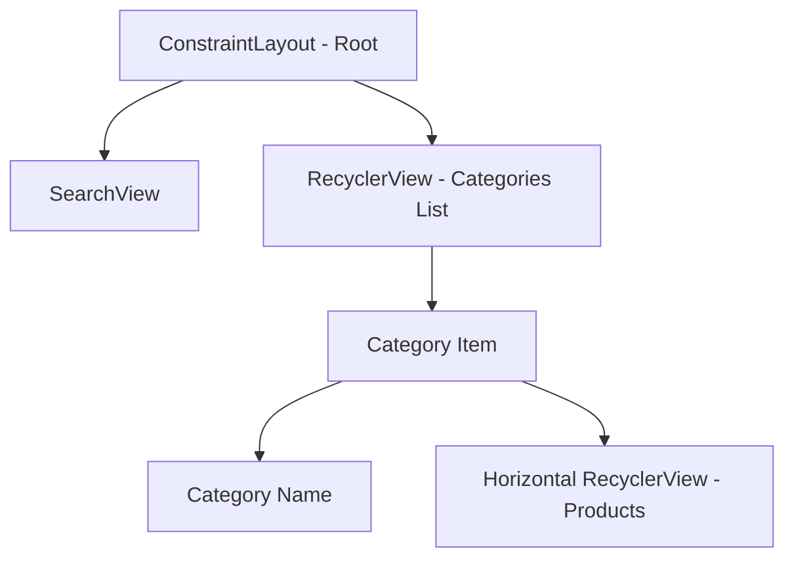
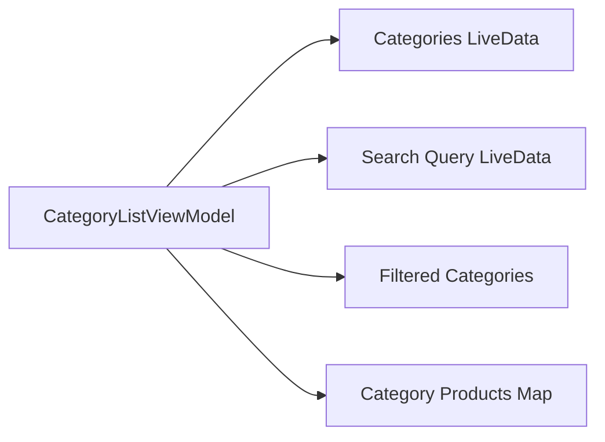

# Category Page Enhancements

## Overview
This document outlines the plan to enhance the categories page in the B-Shop Android application by adding a search bar and implementing horizontal product scrolling for each category.

## UI Components

## Implementation Details

### 1. Layout Changes

#### fragment_category_list.xml
- Add SearchView at the top for category filtering
- Convert current grid layout to vertical list layout
- Add progress indicators for loading states

#### item_category_with_products.xml (New)
- Category header section with image and name
- Horizontal RecyclerView for products
- Loading indicator for products

### 2. Adapter Changes

#### CategoryAdapter Updates
- Implement new ViewHolder for expanded category items
- Handle state management for product loading
- Implement efficient view recycling

#### ProductAdapter (New)
- Horizontal scrolling product list
- Efficient image loading with Picasso
- Click handling for product selection

### 3. ViewModel Enhancements

#### Data Management
- Implement search functionality
- Cache product lists per category
- Handle loading states for categories and products

### 4. Performance Optimizations

#### Lazy Loading
- Load products only when category is visible
- Implement pagination for main category list
- Cache loaded products in ViewModel

#### Memory Management
- Implement efficient view recycling
- Clear product cache when memory pressure is high
- Use weak references for image caching

### 5. User Experience

#### Search Implementation
- Real-time category filtering
- Debounced search input
- Clear visual feedback for search results

#### Loading States
- Shimmer effect for loading items
- Progressive loading for products
- Error states and retry mechanisms

## Technical Considerations

### Data Flow
1. Initial load shows categories with placeholders for products
2. As categories become visible, load their products
3. Search filters categories immediately while maintaining product lists
4. Product lists are cached until memory pressure requires cleanup

### Performance Targets
- Initial load time < 1 second
- Smooth scrolling (60 fps)
- Search response time < 100ms
- Memory usage < 50MB

## Next Steps

1. Implement layout changes
2. Update adapters for new UI structure
3. Enhance ViewModel with search and caching
4. Implement performance optimizations
5. Add loading states and error handling
6. Test and optimize performance