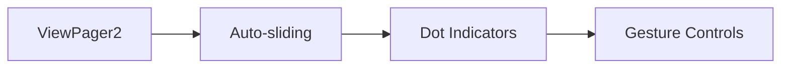
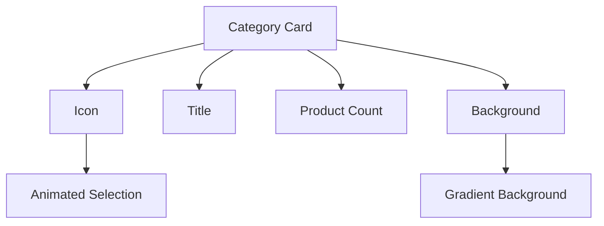
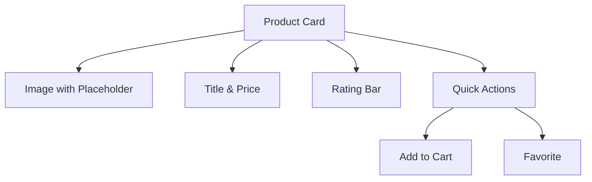
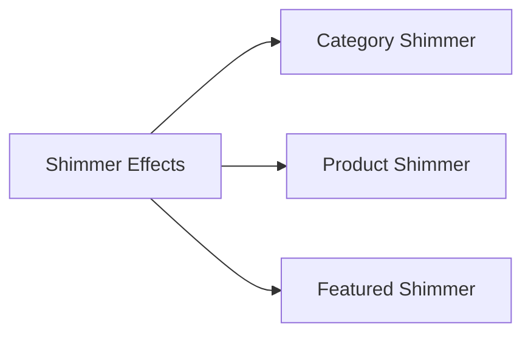
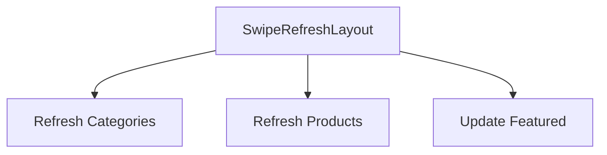

# Home Fragment UI Improvements

## Current Implementation Analysis

The current HomeFragment implementation has:
- Basic horizontal scrolling lists for categories and products
- Simple progress indicators
- Basic Material card for search
- Text-based empty states

## Proposed Improvements

### 1. Featured Products Section


Implementation Details:
```kotlin
// Slider Adapter
class FeaturedSliderAdapter extends RecyclerView.Adapter<FeaturedSliderViewHolder> {
    // Custom ViewHolder for featured items
    // Auto-sliding functionality
    // Touch event handling
}

// XML Layout
<androidx.viewpager2.widget.ViewPager2
    android:id="@+id/featured_slider"
    android:layout_width="match_parent"
    android:layout_height="200dp"/>

<com.google.android.material.tabs.TabLayout
    android:id="@+id/slider_dots"
    android:layout_width="match_parent"
    android:layout_height="wrap_content"
    app:tabBackground="@drawable/dot_selector"
    app:tabGravity="center"/>
```

### 2. Category Cards Design


Implementation Details:
```xml
<!-- category_card.xml -->
<com.google.android.material.card.MaterialCardView
    style="@style/Widget.Material3.CardView.Elevated"
    android:layout_width="120dp"
    android:layout_height="150dp">
    
    <LinearLayout
        android:layout_width="match_parent"
        android:layout_height="match_parent"
        android:orientation="vertical"
        android:gravity="center">

        <ImageView
            android:id="@+id/category_icon"
            android:layout_width="64dp"
            android:layout_height="64dp"/>

        <TextView
            android:id="@+id/category_name"
            style="@style/TextAppearance.Material3.TitleMedium"/>

        <TextView
            android:id="@+id/product_count"
            style="@style/TextAppearance.Material3.BodySmall"/>

    </LinearLayout>

</com.google.android.material.card.MaterialCardView>
```

### 3. Product Cards Design


Implementation Details:
```xml
<!-- product_card.xml -->
<com.google.android.material.card.MaterialCardView
    style="@style/Widget.Material3.CardView.Elevated"
    android:layout_width="160dp"
    android:layout_height="240dp">

    <LinearLayout
        android:layout_width="match_parent"
        android:layout_height="match_parent"
        android:orientation="vertical">

        <ImageView
            android:id="@+id/product_image"
            android:layout_width="match_parent"
            android:layout_height="160dp"
            android:scaleType="centerCrop"/>

        <LinearLayout
            android:layout_width="match_parent"
            android:layout_height="wrap_content"
            android:orientation="vertical"
            android:padding="8dp">

            <TextView
                android:id="@+id/product_name"
                style="@style/TextAppearance.Material3.TitleMedium"/>

            <TextView
                android:id="@+id/product_price"
                style="@style/TextAppearance.Material3.TitleSmall"/>

            <RatingBar
                android:id="@+id/rating_bar"
                style="?android:attr/ratingBarStyleSmall"/>

            <LinearLayout
                android:layout_width="match_parent"
                android:layout_height="wrap_content"
                android:orientation="horizontal">

                <com.google.android.material.button.MaterialButton
                    android:id="@+id/add_to_cart"
                    style="@style/Widget.Material3.Button.IconButton"/>

                <com.google.android.material.button.MaterialButton
                    android:id="@+id/favorite"
                    style="@style/Widget.Material3.Button.IconButton"/>

            </LinearLayout>
        </LinearLayout>
    </LinearLayout>
</com.google.android.material.card.MaterialCardView>
```

### 4. Loading States


Implementation Details:
```xml
<!-- Add to build.gradle -->
implementation 'com.facebook.shimmer:shimmer:0.5.0'

<!-- shimmer_category_card.xml -->
<com.facebook.shimmer.ShimmerFrameLayout
    android:layout_width="120dp"
    android:layout_height="150dp">
    <!-- Shimmer placeholder layout -->
</com.facebook.shimmer.ShimmerFrameLayout>
```

### 5. Pull-to-Refresh


Implementation Details:
```xml
<androidx.swiperefreshlayout.widget.SwipeRefreshLayout
    android:id="@+id/swipe_refresh"
    android:layout_width="match_parent"
    android:layout_height="match_parent">
    
    <!-- Existing NestedScrollView content -->

</androidx.swiperefreshlayout.widget.SwipeRefreshLayout>
```

## Implementation Steps

1. Update Dependencies
```gradle
implementation 'com.google.android.material:material:1.9.0'
implementation 'androidx.viewpager2:viewpager2:1.0.0'
implementation 'com.facebook.shimmer:shimmer:0.5.0'
implementation 'androidx.swiperefreshlayout:swiperefreshlayout:1.1.0'
```

2. Create New Layouts
   - Featured slider layout
   - Enhanced category card
   - Enhanced product card
   - Shimmer placeholder layouts

3. Implement New Adapters
   - FeaturedSliderAdapter
   - Enhanced CategoryAdapter
   - Enhanced ProductAdapter

4. Update HomeFragment
   - Add ViewPager2 for featured products
   - Implement pull-to-refresh
   - Add shimmer effects
   - Enhance navigation and transitions

## Testing Considerations

1. Visual Testing
   - Test on different screen sizes
   - Verify shimmer effects
   - Check animations and transitions

2. Functional Testing
   - Verify auto-sliding behavior
   - Test pull-to-refresh
   - Validate click handlers

3. Performance Testing
   - Monitor memory usage
   - Check scroll performance
   - Verify image loading efficiency