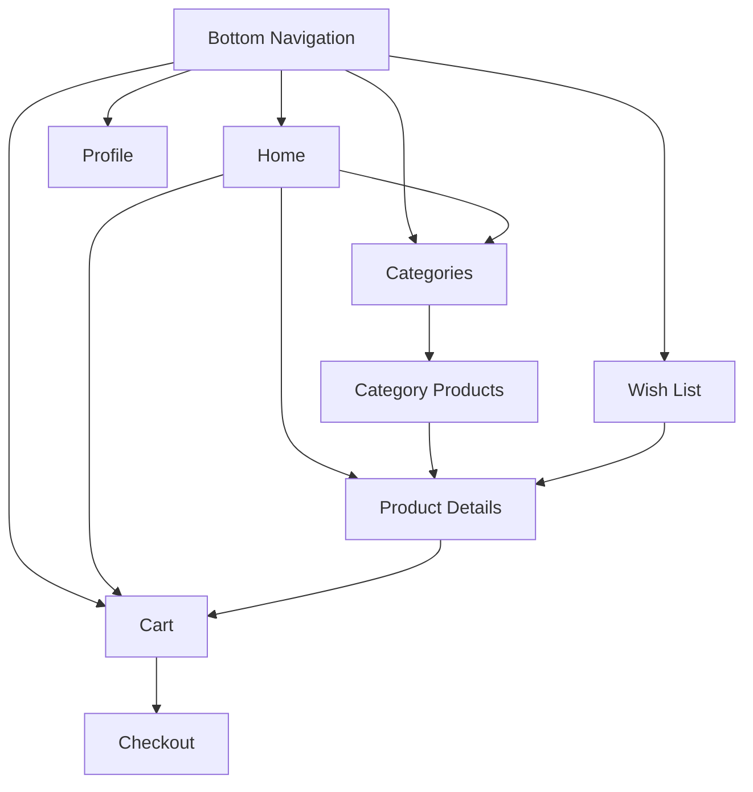

# Navigation Implementation Plan

## Overview
This document outlines the plan for implementing the bottom navigation in the B-Shop Android application. The navigation will consist of five main sections: Home, Categories, Wish List, Cart, and Profile.

## Navigation Structure

## Implementation Steps

### 1. Bottom Navigation Menu Changes
- Update `bottom_nav_menu.xml`:
  - Replace search menu item with wish list
  - Verify existing menu items (Home, Categories, Cart, Profile)
- Update/add necessary icons in drawable resources:
  - Verify existing icons for home, categories, cart, profile
  - Add wish list icon

### 2. Navigation Graph Updates
- Add new fragments to `nav_graph_main.xml`:
  - WishListFragment
  - ProfileFragment
- Add navigation actions:
  - Wish list to product details
  - Profile to relevant sections (orders, settings)
- Update existing navigation paths as needed

### 3. New UI Components

#### WishList Feature
- Create new files:
  - `WishListFragment.java`
  - `WishListViewModel.java`
  - `fragment_wish_list.xml` layout
  - `item_wish_list_product.xml` for list items
- Implement features:
  - Display saved/favorite products
  - Add/remove products from wish list
  - Navigate to product details

#### Profile Feature
- Create new files:
  - `ProfileFragment.java`
  - `ProfileViewModel.java`
  - `fragment_profile.xml` layout
- Implement features:
  - Display user information
  - Account settings
  - Order history
  - Logout functionality

### 4. Database and Repository Layer

#### Wish List Data Management
- Add wish list table to database
- Create WishListRepository
- Implement data operations:
  - Add to wish list
  - Remove from wish list
  - Get wish list items
  - Check if item is in wish list

#### Profile Data Management
- Enhance UserRepository
- Add necessary methods for profile management
- Implement data persistence for user preferences

## Technical Considerations
- Handle navigation state preservation
- Implement proper back stack behavior
- Consider deep linking support
- Handle configuration changes
- Implement proper error handling
- Consider offline support

## Future Enhancements
- Search functionality integration
- Advanced filtering in wish list
- Social sharing features
- Enhanced profile customization