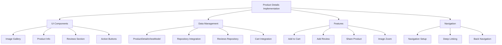

# Product Details Implementation Plan

## Overview


## 1. UI Components Structure

### Layout Implementation (fragment_product_details.xml)
- Image Gallery (ViewPager2)
  - Product images with dot indicators
  - Zoom capability for images
  - Placeholder for loading states
- Product Information Section
  - Title, Price, Rating
  - Description
  - Available sizes/variants (if applicable)
  - Stock status
- Reviews Section
  - Average rating with distribution
  - User reviews list
  - "Write Review" button
- Action Buttons
  - Add to Cart button (with quantity selector)
  - Share button
  - Favorite button

### Custom Views
1. RatingDistributionView
   - Visual representation of rating distribution
   - Interactive rating selection
2. QuantitySelector
   - Custom number picker for product quantity
3. ImageGalleryView
   - Custom ViewPager implementation
   - Zoom gestures support

## 2. Data Management

### ProductDetailsViewModel
```java
public class ProductDetailsViewModel extends AndroidViewModel {
    private final ProductRepository productRepository;
    private final ReviewRepository reviewRepository;
    private final CartRepository cartRepository;
    
    // LiveData for UI states
    private final MutableLiveData<Product> product;
    private final MutableLiveData<List<Review>> reviews;
    private final MutableLiveData<Boolean> isLoading;
    private final MutableLiveData<String> errorMessage;
    
    // Cart operations
    private final MutableLiveData<Boolean> addToCartSuccess;
    
    // Methods for loading data and handling user actions
    public void loadProductDetails(int productId);
    public void addToCart(int quantity);
    public void addReview(Review review);
    public void toggleFavorite();
}
```

### Repository Integration
- Enhanced ProductRepository for detailed product info
- ReviewRepository for managing product reviews
- CartRepository for handling cart operations

## 3. Features Implementation

### Image Gallery
- ViewPager2 with ZoomableImageView
- Custom page transformer for smooth transitions
- Gesture handling for zoom and swipe

### Reviews System
- Review list with pagination
- Review submission form
- Rating distribution chart
- Sort and filter options

### Shopping Features
- Add to Cart functionality
- Quantity selection
- Size/variant selection (if applicable)
- Stock status check

### Social Features
- Share product functionality
- Add to favorites
- Copy product link

## 4. Implementation Steps

1. Create Basic UI
```xml
<!-- fragment_product_details.xml -->
<androidx.coordinatorlayout.widget.CoordinatorLayout>
    <com.google.android.material.appbar.AppBarLayout>
        <!-- Collapsing toolbar with image gallery -->
    </com.google.android.material.appbar.AppBarLayout>
    
    <androidx.core.widget.NestedScrollView>
        <!-- Product information -->
        <!-- Reviews section -->
    </androidx.core.widget.NestedScrollView>
    
    <com.google.android.material.bottomappbar.BottomAppBar>
        <!-- Action buttons -->
    </com.google.android.material.bottomappbar.BottomAppBar>
</androidx.coordinatorlayout.widget.CoordinatorLayout>
```

2. Set Up Navigation
   - Add fragment to navigation graph
   - Implement deep linking
   - Handle back navigation

3. Implement ViewModel and Repository
   - Create ProductDetailsViewModel
   - Enhance repositories
   - Set up LiveData observers

4. Add Features Incrementally
   - Image gallery with zoom
   - Reviews system
   - Cart integration
   - Social features

## 5. Testing Strategy

1. Unit Tests
   - ViewModel logic
   - Repository methods
   - Data transformations

2. Integration Tests
   - Repository integration
   - Cart operations
   - Review submission

3. UI Tests
   - Navigation flow
   - User interactions
   - Image gallery behavior
   - Form validation

## 6. Performance Considerations

1. Image Loading
   - Efficient image loading with Glide
   - Image caching
   - Placeholder handling

2. Reviews Loading
   - Pagination for reviews
   - Lazy loading
   - Cache management

3. State Management
   - Handle configuration changes
   - Save instance state
   - Memory management