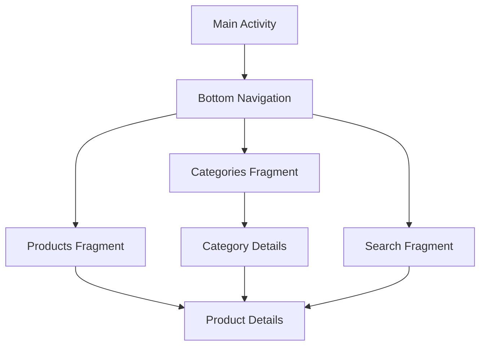
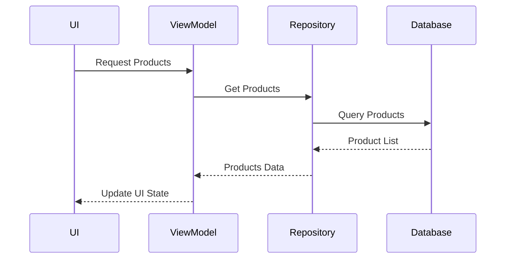

# Product Management Implementation Plan

## 1. Main Product Interface



## 2. Components Structure

### 2.1 Fragments
1. Categories List Fragment
   - Grid layout of categories
   - Category cards with images
   - Click to view category products

2. Products List Fragment
   - RecyclerView with product cards
   - Filtering options
   - Sort by price, name, rating
   - Quick add to cart/wishlist

3. Search Fragment
   - Search bar with filters
   - Real-time search suggestions
   - Advanced filter options
   - Recent searches

4. Product Details Fragment
   - Product images
   - Detailed information
   - Reviews section
   - Add to cart button
   - Add to wishlist button

### 2.2 ViewModels
1. ProductViewModel
   - Product list management
   - Search functionality
   - Filtering logic
   - Sort operations

2. CategoryViewModel
   - Category list management
   - Category-based product filtering

3. ProductDetailsViewModel
   - Product details
   - Reviews management
   - Cart/Wishlist operations

## 3. UI Components

### 3.1 Custom Views
1. ProductCardView
   - Product image
   - Basic info
   - Quick action buttons

2. CategoryCardView
   - Category image
   - Category name
   - Product count

3. FilterChipGroup
   - Dynamic filter options
   - Selected filters display

### 3.2 Layouts
1. fragment_categories.xml
2. fragment_products.xml
3. fragment_product_details.xml
4. fragment_search.xml
5. item_product_card.xml
6. item_category_card.xml

## 4. Implementation Steps

1. Base Setup
   - Create necessary fragments
   - Set up navigation graph
   - Implement bottom navigation

2. Category Implementation
   - Create CategoryCardView
   - Implement categories list
   - Add category filtering

3. Product List Implementation
   - Create ProductCardView
   - Implement product grid/list
   - Add sorting functionality
   - Implement filtering system

4. Search Implementation
   - Create search interface
   - Implement search logic
   - Add filter options
   - Implement suggestions

5. Product Details
   - Create detailed view
   - Implement image gallery
   - Add reviews section
   - Implement actions (cart/wishlist)

## 5. Data Flow



## 6. Dependencies

```gradle
// Image loading
implementation 'com.github.bumptech.glide:glide:4.12.0'
annotationProcessor 'com.github.bumptech.glide:compiler:4.12.0'

// RecyclerView
implementation 'androidx.recyclerview:recyclerview:1.3.0'

// CardView
implementation 'androidx.cardview:cardview:1.0.0'

// ViewPager2 for product images
implementation 'androidx.viewpager2:viewpager2:1.0.0'
```

## 7. Testing Strategy

1. Unit Tests
   - ViewModels
   - Repository methods
   - Search algorithms
   - Filter logic

2. Integration Tests
   - Database operations
   - Repository integration
   - Navigation flow

3. UI Tests
   - Product list scrolling
   - Search functionality
   - Filter interactions
   - Category navigation

## 8. Next Steps

1. Implement category listing
2. Create product grid view
3. Implement search functionality
4. Add product details view
5. Integrate with cart system