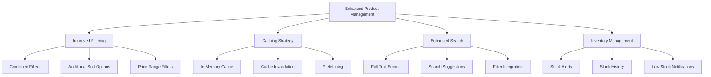

# Product Management System Improvements

## Overview

This document outlines planned improvements to the B-Shop product management system to enhance filtering, caching, search functionality, and inventory management.

## 1. Enhanced Filtering System

### Current Limitations
- Basic filtering implementation
- Cannot combine multiple filters
- Limited sorting options
- No pagination support

### Planned Improvements
1. Implement FilterBuilder pattern
   - Support multiple concurrent filters
   - Chainable filter operations
   - Dynamic query building

2. Extended Sorting Options
   - Price (ascending/descending)
   - Name (alphabetical)
   - Date added
   - Popularity (based on views/purchases)

3. Pagination Implementation
   - Configurable page size
   - Cursor-based pagination
   - Efficient memory usage

## 2. Caching Strategy

### Current Limitations
- No caching implementation
- Repeated database queries
- Potential performance issues

### Planned Improvements
1. In-Memory Cache
   - LRU cache implementation
   - Configurable cache size
   - Memory usage monitoring

2. Cache Invalidation
   - Time-based invalidation
   - Event-based invalidation
   - Selective cache updates

3. Prefetching
   - Category-based prefetching
   - Popular products caching
   - Smart preloading based on user behavior

## 3. Enhanced Search

### Current Limitations
- Basic text search
- No search suggestions
- Limited integration with filters

### Planned Improvements
1. Full-Text Search
   - FTS tables in Room
   - Relevance scoring
   - Fuzzy matching support

2. Search Suggestions
   - History-based suggestions
   - Popular searches
   - Category-aware suggestions

3. Integrated Filtering
   - Combined search and filter operations
   - Real-time result updates
   - Performance optimization

## 4. Inventory Management

### Current Limitations
- Basic stock tracking
- No history tracking
- Limited stock management features

### Planned Improvements
1. Stock History
   - Track all stock changes
   - Audit trail
   - Stock adjustment reasons

2. Stock Alerts
   - Low stock notifications
   - Reorder point alerts
   - Stock level thresholds

3. Analytics
   - Stock turnover rate
   - Popular products tracking
   - Seasonal trends analysis

## Implementation Priority

1. Enhanced Filtering System
   - Most immediate impact on user experience
   - Foundation for other improvements

2. Caching Strategy
   - Performance optimization
   - Reduced database load

3. Enhanced Search
   - Improved product discovery
   - Better user engagement

4. Inventory Management
   - Better stock control
   - Reduced out-of-stock situations