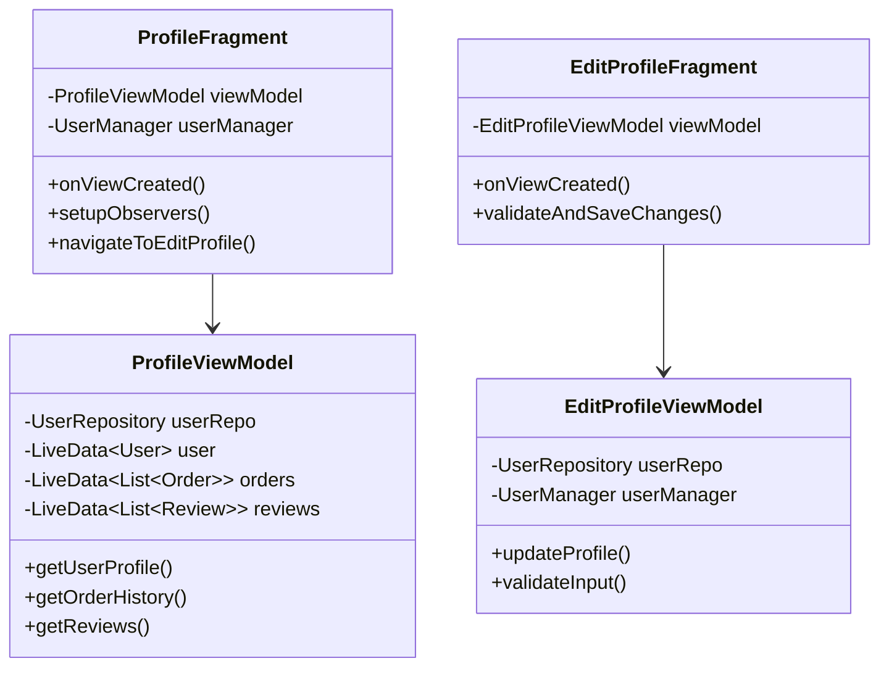
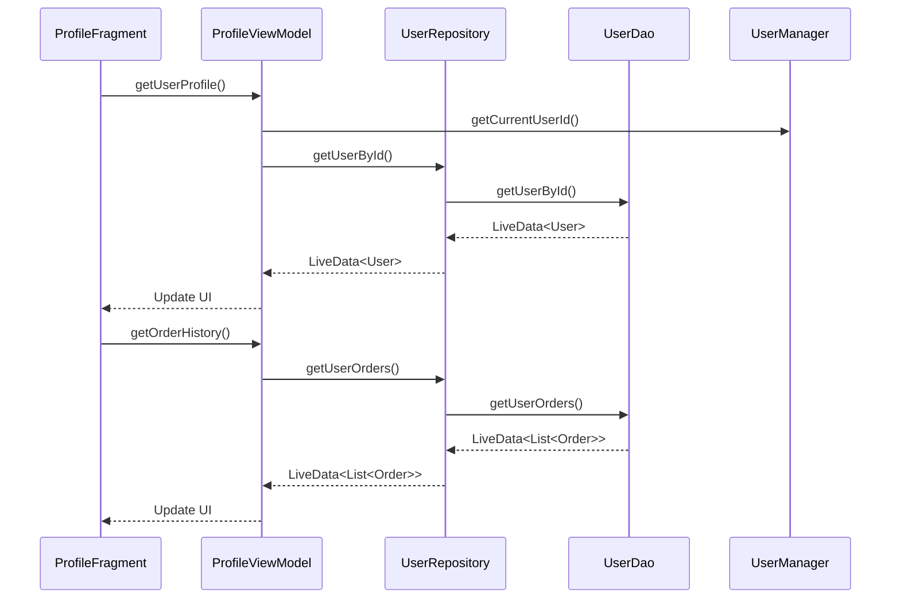
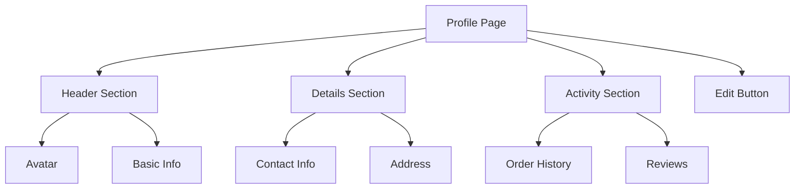

# Profile Feature Architecture

## Overview
This document outlines the architecture for implementing a comprehensive user profile feature in the B-Shop Android app. The profile page will display user details, order history, and reviews, with a separate screen for profile editing.

## Component Structure

## Data Flow

## Layout Structure

## Implementation Components

### 1. Layout Files
- **fragment_profile.xml**
  - Main profile view layout
  - Contains sections for user info, orders, and reviews
  - Edit button to navigate to edit screen

- **fragment_edit_profile.xml**
  - Form layout for editing profile
  - Input fields for all user properties
  - Save and cancel buttons

- **item_order_history.xml**
  - Layout for individual order items
  - Displays order ID, date, status, total

- **item_user_review.xml**
  - Layout for user reviews
  - Shows product name, rating, review text

### 2. UI Components

#### ProfileFragment
- Displays user profile information
- Manages navigation to edit screen
- Handles data observation and UI updates

#### EditProfileFragment
- Handles profile editing functionality
- Implements form validation
- Manages profile update process

#### Adapters
- OrderHistoryAdapter for order list
- UserReviewAdapter for reviews list

### 3. ViewModels

#### ProfileViewModel
- Manages profile data retrieval
- Coordinates between UI and Repository
- Handles loading states and errors

#### EditProfileViewModel
- Manages profile update process
- Handles input validation
- Coordinates with UserManager for session updates

### 4. Navigation
Updates to `nav_graph_main.xml`:
- Add profile fragment destination
- Add edit profile fragment destination
- Define transitions between fragments
- Set up deep linking support

### 5. Data Layer Integration

#### Existing Components
- Utilize UserRepository for data operations
- Leverage UserDao for database access
- Use UserManager for session management

#### Required Updates
- Review User entity for missing fields
- Ensure proper error handling
- Implement caching strategy

## Key Features

### 1. Profile Display
- User avatar with update capability
- Basic information section
  - Name
  - Email
  - Phone
- Address information
- Order history section
  - Recent orders
  - Order status
- Reviews section
  - Product reviews
  - Ratings

### 2. Profile Editing
- Separate edit screen
- Form validation
- Image upload for avatar
- Success/error feedback
- Session state management

### 3. Data Management
- Cached profile data
- Real-time updates
- Error handling
- Loading states
- Offline support

## Implementation Strategy

1. Set up UI components and layouts
2. Implement ViewModels and data flow
3. Add navigation components
4. Integrate with existing data layer
5. Add error handling and loading states
6. Implement profile editing
7. Add order history and reviews
8. Implement avatar management
9. Add form validation
10. Test and refine

## Testing Strategy

1. Unit Tests
   - ViewModel logic
   - Repository operations
   - Data validation

2. Integration Tests
   - Database operations
   - Navigation flow
   - Data flow

3. UI Tests
   - Profile display
   - Edit functionality
   - Form validation
   - Error states