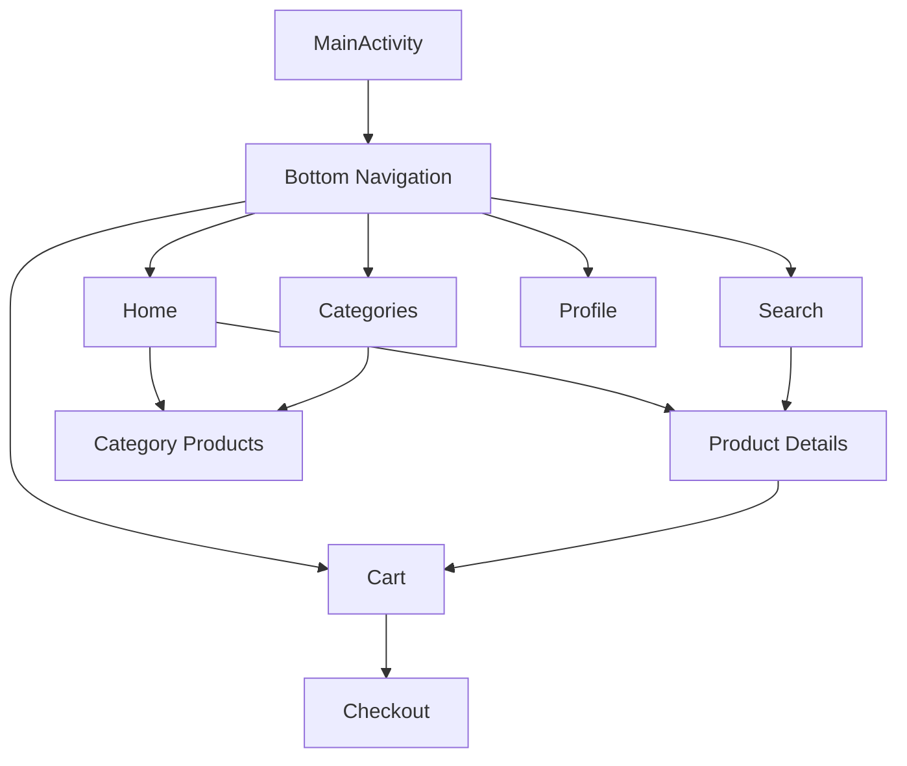

# UI Implementation Plan

## Current Implementation Status

The app already has a basic navigation structure set up with:
- Bottom navigation menu with 5 main sections
- Navigation graph with defined fragments and actions
- MainActivity handling navigation setup

## Required UI Implementations

### 1. Fragment Implementations
1. Home Fragment
   - Featured products slider
   - Categories horizontal list
   - Top rated products grid
   - New arrivals section

2. Categories Fragment
   - Grid layout of categories
   - Category card design
   - Animation for selection

3. Search Fragment
   - Search bar with filters
   - Recent searches
   - Search results grid
   - Filter bottom sheet

4. Cart Fragment
   - Cart items list
   - Price summary
   - Checkout button
   - Empty cart state

5. Profile Fragment
   - User information section
   - Orders history
   - Wishlist
   - Settings

### 2. Common UI Components
1. Product Card
   - Image
   - Title
   - Price
   - Rating
   - Add to cart button

2. Category Card
   - Image
   - Name
   - Products count

3. Loading States
   - Shimmer effect
   - Progress indicators
   - Error states

4. Common Buttons
   - Primary action button
   - Secondary action button
   - Icon buttons

### 3. Design System
1. Colors
   - Primary colors
   - Secondary colors
   - Status colors
   - Background colors

2. Typography
   - Headings
   - Body text
   - Button text
   - Labels

3. Spacing System
   - Margins
   - Padding
   - Grid spacing

4. Animations
   - Transitions
   - Loading animations
   - Button feedback

## Implementation Priority

1. Base UI Components
   - Create reusable layouts
   - Implement design system
   - Set up common components

2. Main Screens
   - Home fragment
   - Categories fragment
   - Product details

3. Shopping Features
   - Cart implementation
   - Search functionality
   - Checkout flow

4. Profile Section
   - User profile
   - Order history
   - Settings

## Technical Considerations

1. Performance
   - Use RecyclerView for lists
   - Implement view binding
   - Efficient image loading with Glide
   - Pagination for long lists

2. Responsiveness
   - Support different screen sizes
   - Handle orientation changes
   - Adaptive layouts

3. State Management
   - ViewModels for each fragment
   - LiveData for UI updates
   - SavedState for configuration changes

4. Navigation
   - Deep linking support
   - Proper back stack handling
   - Animation transitions

## Testing Strategy

1. UI Tests
   - Fragment testing
   - Navigation testing
   - Input validation

2. Integration Tests
   - Navigation flow
   - Data display
   - User interactions

3. Visual Tests
   - Layout verification
   - Dark mode support
   - Different screen sizes